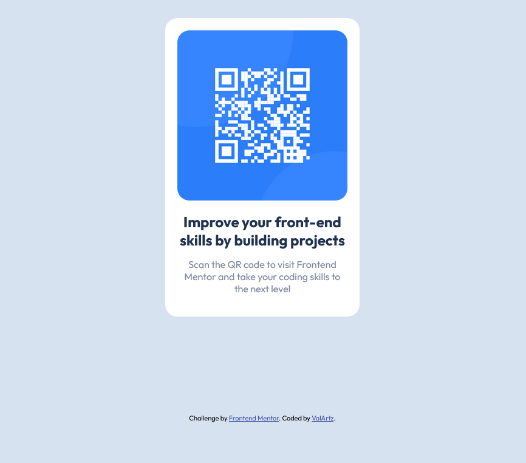

# Frontend Mentor - QR code component solution

This is a solution to the [QR code component challenge on Frontend Mentor](https://www.frontendmentor.io/challenges/qr-code-component-iux_sIO_H). Frontend Mentor challenges help you improve your coding skills by building realistic projects. 

## Overview

### Screenshot

### Links

- Solution URL: [https://github.com/ValArtz/QR-code-component-Solution.git](https://github.com/ValArtz/QR-code-component-Solution.git)
- Live Site URL: [Add live site URL here](https://your-live-site-url.com)
